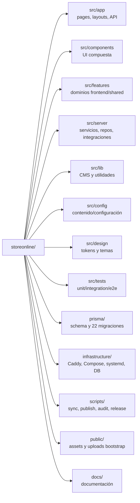
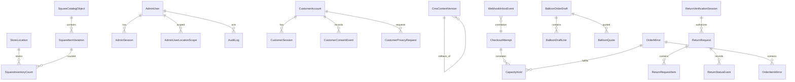
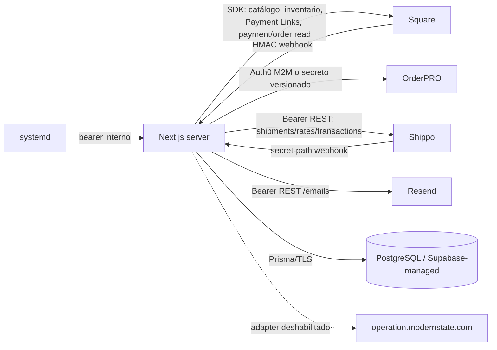
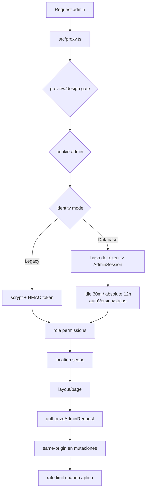
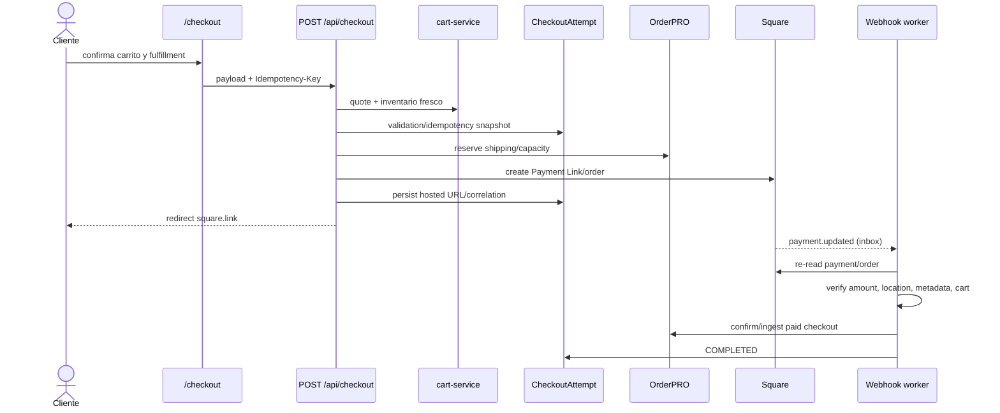
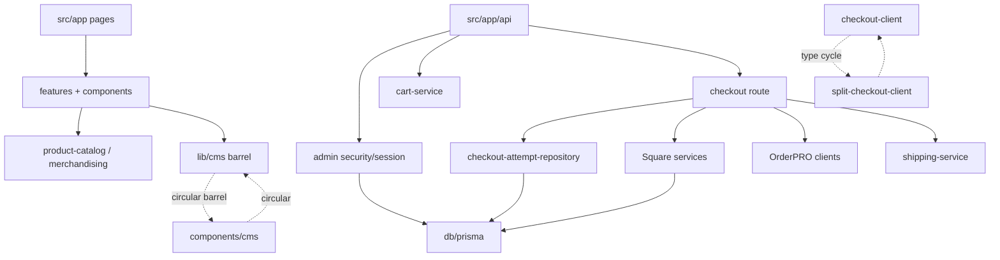
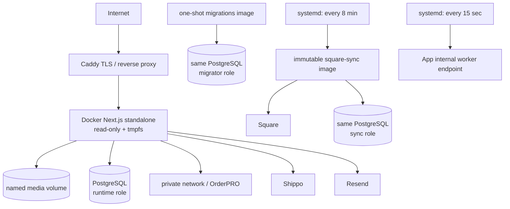

# Technical Project Map

> Radiografía técnica del árbol de trabajo observada el 20 de agosto de 2026. Este documento describe la implementación presente; no certifica el estado de producción ni sustituye una auditoría de seguridad.

## Convenciones de evidencia

- **HECHO CONFIRMADO**: observado en código, configuración, esquema o pruebas.
- **INFERENCIA**: conclusión razonable al cruzar varias evidencias, sin ejecución end-to-end.
- **SOSPECHA**: señal que requiere verificación dinámica o decisión del equipo.
- **RECOMENDACIÓN**: acción propuesta; no fue aplicada durante este mapeo.
- `UNKNOWN — requiere investigación`: el repositorio no contiene evidencia suficiente.

Las líneas son aproximadas y corresponden al árbol de trabajo analizado. Se excluyeron de lectura detallada dependencias (`node_modules`), builds (`.next*`), reportes Playwright, binarios, logs y paquetes de release.

---

## 1. Executive Summary

**HECHO CONFIRMADO.** El proyecto es un monolito modular de comercio electrónico construido con Next.js App Router. El mismo proceso sirve storefront, panel administrativo, rutas API y endpoints internos de workers. PostgreSQL, vía Prisma, mantiene proyecciones de Square, CMS, identidad, intentos de checkout, inbox de webhooks, devoluciones, clientes y auditoría. Square es la autoridad de catálogo/inventario y el procesador de pagos; OrderPRO es la autoridad operativa para pickup, delivery, shipping y órdenes pagadas; Shippo cotiza y compra etiquetas; Resend entrega códigos y pruebas de email.

```mermaid
flowchart TD
  Customer[Cliente] --> Store[Storefront Next.js]
  Admin[Administrador] --> AdminUI[Admin Next.js]
  Store --> API[Route Handlers /api]
  AdminUI --> Guard[proxy + sesión + RBAC]
  Guard --> API
  API --> Services[Servicios de dominio/servidor]
  Services --> Prisma[Prisma]
  Prisma --> PG[(PostgreSQL)]
  Services --> Square[Square API]
  Services --> OrderPRO[OrderPRO]
  Services --> Shippo[Shippo REST]
  Services --> Resend[Resend REST]
  Square --> SW[Webhook Square]
  Shippo --> HW[Webhook Shippo]
  SW --> Inbox[(WebhookInboxEvent)]
  HW --> Inbox
  Worker[systemd timers] --> Internal[/api/internal workers]
  Internal --> Inbox
  Internal --> Services
```

Puntos principales:

- **P0:** `src/app/api/checkout/route.ts` coordina validación, reservas OrderPRO, creación del link alojado Square, persistencia idempotente y compensaciones. Con 966 líneas y 12 dependencias internas es el mayor punto de acoplamiento transaccional.
- **P0:** la confirmación no confía en el redirect del navegador. Los webhooks vuelven a consultar pago/orden en Square, validan evidencia y recién entonces confirman reservas/órdenes.
- **P0 condicionado al lanzamiento:** el bootstrap ACL de PostgreSQL concede al rol runtime un subconjunto de administración/preview y niega explícitamente tablas transaccionales. Los flujos de checkout, cuenta de cliente y devoluciones necesitan un diseño ACL ampliado o roles separados antes de habilitarse con esos roles.
- **P1:** catálogo e inventario se leen desde una proyección PostgreSQL sincronizada de Square. El merchandising publicado vive principalmente como JSON versionado en `CmsContentVersion`, aunque el esquema conserva tablas relacionales de merchandising que parecen legado o transición.
- **P1:** el carrito de usuario vive en `localStorage` (`modern-state-cart`); `Cart` y `CartItem` de Prisma no participan en el flujo observado.
- **P1:** `README.md`, `docs/security.md`, `docs/fulfillment.md` y partes de `docs/deployment.md` todavía describen checkout “validation-only”; la implementación actual sí puede crear órdenes/links alojados bajo feature flags.
- **P2:** dos ciclos estáticos de imports atraviesan barrels CMS/homepage y checkout. Hay varios archivos de 800–3.273 líneas con responsabilidades mezcladas.
- **P2:** `@square/web-sdk`, `shippo`, `mapbox-gl` y `class-variance-authority` figuran en dependencias, pero no tienen imports runtime encontrados. El código usa SDK Square server-side y REST directo de Shippo.

## 2. Technology Stack

| Capa | Tecnología | Evidencia / uso |
|---|---|---|
| Runtime | Node.js 24.18.x, npm 11.16 | `package.json` `engines`; Dockerfile |
| Web | Next.js 16.2.12 App Router | `src/app`, `next.config.mjs` |
| UI | React 19.2.7, TypeScript 6.0.3 strict | `package.json`, `tsconfig.json` |
| Estilos | Tailwind CSS 3.4, CSS Modules, tokens CSS | `tailwind.config.ts`, `src/design`, `src/app/globals.css` |
| Validación | Zod 4.4 | Schemas en route handlers y contratos server |
| Persistencia | Prisma 6.19 + PostgreSQL | `prisma/schema.prisma` |
| Pagos/catálogo | Square SDK server 45.0.1 | `src/server/square`, `src/server/square/hosted-checkout.ts` |
| Fulfillment | APIs privadas OrderPRO | `src/server/orderpro` |
| Envíos | Shippo REST | `src/server/shipping`, `src/server/returns/shippo-return-label.ts` |
| Email | Resend REST | servicios de identidad/notificaciones |
| Observabilidad | `@sentry/nextjs` en workers internos | dos rutas `src/app/api/internal/**` |
| Unit/integration | Vitest + jsdom | `vitest*.config.ts`, `src/tests` |
| E2E | Playwright desktop/mobile | `playwright*.config.ts` |
| Infra | Docker multi-stage, Compose, Caddy, systemd | `Dockerfile`, `infrastructure/` |
| CI | GitHub Actions | `.github/workflows` |

**HECHO CONFIRMADO.** Supabase aparece como PostgreSQL administrado y en scripts ACL, pero no hay SDK Supabase en runtime. Mapbox aparece en dependencia, CSP y variables de ejemplo, pero no se encontró consumo runtime: **PROBABLEMENTE PLANIFICADO**.

## 3. Repository Structure



El árbol activo contiene 662 archivos bajo `src`: `app` 135, `components` 111, `config` 14, `design` 15, `features` 73, `lib` 21, `server` 116 y `tests` 175. `src/server` concentra la mayor cantidad de lógica (aprox. 22.235 líneas); `src/components` y `src/features` también alojan lógica considerable.

**Artefactos no fuente:** `.next`, `.next-e2e`, `.playwright*`, `node_modules`, `output`, archivos `*.tar.gz`, logs y `*.tsbuildinfo`. `backups/` es histórico. `index.html` en raíz es una página estática “Site under maintenance”, no un entry point del App Router observado.

## 4. Folder Map

| Ruta | Clase | Responsabilidad real | Dependientes / observaciones |
|---|---|---|---|
| `src/app` | Entry Point / Page / API | Routing App Router, layouts, metadata, route handlers | Une UI y backend. Correcto para Next; checkout API demasiado grande. |
| `src/components` | UI / Component | UI global, admin, checkout, fulfillment, devoluciones | Algunas piezas contienen estado y orquestación de negocio; mezcla notable. |
| `src/features/catalog` | Domain/UI/Service | Catálogo visible, merchandising y hojas de cálculo | Central; abastece rutas de tienda, checkout y admin. |
| `src/features/homepage` | Domain/UI/Configuration | Render y edición visual de homepage | Editor de 3.273 líneas; alta complejidad. |
| `src/features/fulfillment` | Contracts/Domain | Contratos pickup/delivery y utilidades | Compartido con clientes OrderPRO y UI. |
| `src/features/checkout` | Contract | Contrato de paid checkout OrderPRO | Flujo principal vive en route/server, no aquí. |
| `src/features/returns` | Contracts | Tipos/contratos del portal de devoluciones | Consumido por componentes y server. |
| `src/server/admin` | Service/Repository/Auth | CMS, merchandising, identidad, auditoría, RBAC, clientes | Amplio plano de control; acceso DB disperso en repos especializados. |
| `src/server/checkout` | Service/Repository/Integration | Idempotencia, intentos, hosted checkout, confirmación Square | P0; frontera transaccional. |
| `src/server/square` | Integration/Repository | Sync catálogo, proyección, inventario, cliente Square | Autoridad comercial externa; P0/P1. |
| `src/server/orderpro` | Integration | Fulfillment, shipping, returns, paid checkout, preview | Varios clientes versionados; autoridad operativa. |
| `src/server/shipping` | Service/Integration | Cotización Shippo y validación de selección | REST directo; P1. |
| `src/server/returns` | Service/Repository/Integration | Verificación, RMA, evidencia, etiquetas, eventos | P0/P1 por datos personales y reembolsos. |
| `src/server/webhooks` | Webhook/Worker | Verificación, inbox, dispatch, reintentos | P0. |
| `src/server/db` | Database/ORM | Singleton Prisma y helpers JSON | 43 imports; boundary central. |
| `src/server/operations-access` | Integration | Sincroniza/revoca acceso hacia plano Operations | Deshabilitado hasta completar contrato. |
| `src/lib/cms` | Domain/Utility | Documento CMS, registry, defaults, validación, adapters | Barrel muy central y ciclo con componentes/homepage. |
| `src/config` | Configuration/Data | Ubicaciones, holidays, rutas admin, páginas, producto fallback | Parte es fallback/metadata; dependencia frecuente. |
| `src/design` | UI/Configuration | Foundations, tokens y temas storefront/admin/balloons | `admin.theme.css` 3.816 líneas. |
| `src/tests` | Testing | Unit, integración, live y E2E | 175 archivos; cubre contracts, seguridad y flujos. |
| `prisma` | Schema/Migration | 56 modelos, enums, 22 migraciones | Fuente del modelo relacional. |
| `infrastructure` | Infrastructure | despliegue, Caddy, Compose, roles DB, timers | Separa migrator/sync/runtime y redes. |
| `scripts` | Script/CLI | sync Square, publish/rollback CMS, auditorías, release | Algunos comandos destructivos exigen confirmación explícita. |
| `data` | Dev data/cache | CMS/merchandising local y snapshots | Fallback de desarrollo; ignorado en producción. |
| `public` | Static/Storage bootstrap | imágenes, fuentes y uploads iniciales | En producción uploads usan volumen nombrado. |
| `docs` | Documentation | runbooks, handoffs, planes y guías | Mezcla estado actual con documentos históricos. |

## 5. File Map

### 5.1 Entry points y configuración

| Archivo | Tipo | Qué hace / exporta | Importa / lo usa | Riesgo |
|---|---|---|---|---|
| `src/app/layout.tsx` | Entry Point | layout raíz, metadata y shell global | Next lo carga para todo el árbol | P1 |
| `src/app/(store)/layout.tsx` | Entry Point | shell storefront, catálogo/config publicados; `force-dynamic` | todas las páginas tienda | P1 |
| `src/app/(checkout)/layout.tsx` | Entry Point | shell aislado de cart/checkout | rutas checkout | P1 |
| `src/app/(admin)/admin/layout.tsx` | Auth/Page | exige sesión admin, navegación, `noindex` | todas las páginas admin | P0 |
| `src/proxy.ts` | Middleware | preview/design gates, sesión y permiso mínimo por ruta | entry automático Next; matcher global | P0 |
| `next.config.mjs` | Configuration | CSP, headers, redirects antiguos, imágenes Square, standalone | build/runtime Next | P1 |
| `src/lib/validation/env.ts` | Validation/Config | valida gran parte del entorno y flags | servicios server | P0 |
| `src/config/admin-route-registry.ts` | Configuration | catálogo canónico de rutas admin y redirects/external | navegación/tests; no asumir dead por cero import directo | P2 |
| `src/config/admin-route-permissions.ts` | Authorization | permisos mínimos de páginas admin | `proxy.ts` | P0 |

### 5.2 Catálogo, CMS y presentación

| Archivo | Tipo | Responsabilidad | Datos / integraciones | Observación |
|---|---|---|---|---|
| `src/features/catalog/product-catalog.ts` | Domain facade | catálogo/fallback y tipos reutilizados | config + servicios catálogo | 53 dependientes; módulo más central. |
| `src/features/catalog/services/website-merchandising-service.ts` | Domain Service | resuelve categorías, visibilidad, placement y estado web | CMS merchandising | 577 líneas; muy reutilizado. |
| `src/server/square/website-catalog-store.ts` | Repository | lee proyección publicable Square/Postgres | Prisma, merchandising publicado | fuente operativa storefront. |
| `src/server/admin/website-merchandising-store.ts` | Repository/Service | CRUD/versionado de merchandising | `CmsContentVersion`, fallback local | admin y publication scripts. |
| `src/server/admin/website-merchandising-publication.ts` | Use Case | prepara/publica/rollback de merchandising | store + validaciones | cambios de visibilidad. |
| `src/lib/cms/index.ts` | Barrel | reexporta contrato CMS completo | UI, config, server | participa en ciclo estático. |
| `src/components/cms/page-renderer.tsx` | Component | renderiza secciones CMS registradas | `@/lib/cms` | completa ciclo vía barrel. |
| `src/features/homepage/components/homepage-template.tsx` | Component | decide render CMS/fallback de homepage | CMS, catálogo, secciones | componente de página central. |
| `src/features/homepage/components/admin/homepage-studio-editor.tsx` | Admin UI/God component | editor completo de homepage | estado, preview, publicación | 3.273 líneas; P1 mantenibilidad. |
| `src/components/admin/product-placement-manager.tsx` | Admin UI/God component | placement, import XLSX y edición | API admin + read-excel-file | 1.396 líneas. |

### 5.3 Comercio, checkout y fulfillment

| Archivo | Tipo | Responsabilidad | Datos / integraciones | Riesgo |
|---|---|---|---|---|
| `src/components/commerce/add-to-cart-button.tsx` | UI/State | persiste/lee carrito `modern-state-cart` | localStorage | P1 |
| `src/server/checkout/cart-service.ts` | Domain Service | revalida catálogo, precio, cantidad, inventario, modo y calcula grupos/impuesto | Square projection + CMS | P0 |
| `src/app/api/checkout/route.ts` | API/God orchestrator | checkout v1 y split v2, idempotencia, reservas, Square, compensación | Prisma, Square, OrderPRO, Shippo | P0 |
| `src/server/checkout/checkout-attempt-repository.ts` | Repository | lifecycle de `CheckoutAttempt` y correlaciones | Prisma | P0 |
| `src/server/square/hosted-checkout.ts` | Integration/Service | crea/elimina Square Payment Link y valida host | Square SDK | P0 |
| `src/server/webhooks/shipping-payment-confirmation.ts` | Use Case | revalida pago/orden y confirma shipping OrderPRO | Square + OrderPRO + DB | P0 |
| `src/server/webhooks/split-checkout-payment-confirmation.ts` | Use Case | verifica evidencia split e ingesta orden pagada | Square + OrderPRO + DB | P0 |
| `src/server/orderpro/storefront-fulfillment-client.ts` | Integration | cotiza pickup/delivery, reserva/bind/release capacidad | OrderPRO | P0 |
| `src/server/orderpro/shipping-order-client.ts` | Integration | quote/create/bind/confirm/release shipping | OrderPRO | P0 |
| `src/server/shipping/shipping-service.ts` | Integration/Domain | Shippo shipments/rates y validación de selección | Shippo REST | P1 |
| `src/server/webhooks/webhook-inbox.ts` | Repository/Queue | inbox durable, lease, retry y dead letter | `WebhookInboxEvent` | P0 |
| `src/server/webhooks/square-webhook-handler.ts` | Webhook | dispatch catálogo/inventario/pago/refund | Square + servicios checkout | P0 |

### 5.4 Identidad, clientes, devoluciones y seguridad

| Archivo | Tipo | Responsabilidad | Seguridad |
|---|---|---|---|
| `src/server/admin/admin-security.ts` | AuthN/AuthZ | legacy bootstrap, cookies y helpers admin | scrypt/HMAC; P0 |
| `src/server/admin/identity/{admin-activation-service,admin-database-login,admin-user-service}.ts` | AuthN Service | activación, login, TOTP/recovery, sesiones DB | P0 |
| `src/server/admin/identity/admin-session-store.ts` y `admin-user-service.ts` | Repository/Service | sesiones, usuarios, scopes y recuperación | Prisma; P0 |
| `src/server/admin/admin-session.ts` | AuthZ | resuelve sesión y permisos/location scope | usado por layouts/pages/APIs; P0 |
| `src/server/admin/admin-security.ts` (`authorizeAdminRequest`) | AuthZ/CSRF | permiso de API y origen en mutaciones | P0 |
| `src/server/admin/admin-rate-limit.ts` | Security | fixed window PostgreSQL en prod, memoria en dev | P0/P1 |
| `src/server/customers/customer-account-service.ts` | AuthN/Domain | passwordless, perfil, consentimiento | Resend + Prisma; P0 |
| `src/server/returns/return-service.ts` | Domain Service | verificación, cotización, RMA y eventos | OrderPRO/Shippo + DB; P0/P1 |
| `src/server/returns/return-repository.ts` | Repository | persistencia portal de devoluciones | 739 líneas; P0 |
| `src/components/returns/returns-portal.tsx` | UI/Workflow | máquina de estados del portal | APIs returns; 1.062 líneas |

### 5.5 Infra, scripts, tests y generados

- `Dockerfile`: targets `migrations`, `square-sync` y runner standalone; **Infrastructure, P1**.
- `infrastructure/production/compose.yml`: servicio app read-only, migración one-shot, redes y volumen media; **Infrastructure, P0/P1**.
- `infrastructure/postgres/bootstrap-storefront-roles.sql`: roles/grants/revokes exactos; **Security/Database, P0**.
- `infrastructure/hostinger/systemd/*` y `infrastructure/production/systemd/*`: timers para sync Square (8 min) y worker webhook (15 s); **Worker entry points, P0/P1**.
- `scripts/sync-square-postgres-read-only.ts`: sincroniza proyección Square; **Script/Integration, P0/P1**.
- `scripts/publish-website-merchandising.ts` y rollback: publicación controlada; **Script, P1**.
- `scripts/bootstrap-store-locations.mjs`, import/compact/reconcile: mutan datos sólo con confirmación; **Script sensible**.
- `prisma/migrations/*`: historia forward-only; se agrupa por compartir responsabilidad **Migration**. No se modificó.
- `src/tests/{unit,integration,e2e}`: suites homogéneas agrupadas; además hay tests `*.live.test.ts` con configuración separada.
- Prisma Client, builds, reportes y paquetes: **Generated**, fuera del inventario lógico.

## 6. Application Entry Points

| Entrada | Inicio | Secuencia resumida |
|---|---|---|
| Web | `next start` / imagen runner | Next carga root layout → route group layout → page o route handler. |
| Storefront | `src/app/(store)/**/page.tsx` | server component lee catálogo/CMS → template/componente cliente. |
| Admin | `src/proxy.ts` + admin layout | gates → cookie/sesión → RBAC → página/servicio admin. |
| API | `src/app/api/**/route.ts` | parsing/validación → guard → service/repository/integration → Response. |
| Square webhook | `POST /api/webhooks/square` | raw body <=512 KB → HMAC URL+body → inbox durable → 202. |
| Shippo webhook | `POST /api/webhooks/shippo/[secret]` | secreto opaco + límite body → inbox durable → 202. |
| Worker webhook | `POST /api/internal/webhooks/process` | bearer worker → leases/retry/dispatch + cleanup expirados. |
| Sync Square | `POST /api/internal/square/catalog-sync` o CLI | bearer/entorno → Square read-only → upsert proyección/estado. |
| Migrations | target Docker `migrations` / `prisma migrate deploy` | credencial migrator → aplica migraciones pendientes. |
| Timers | `infrastructure/{hostinger,production}/systemd/*.timer` | systemd llama workers/sync con intervalos definidos. |
| CLI | scripts de `package.json` y `scripts/` | audit, bootstrap, publish, rollback, sync, live tests y release. |

No se encontró un proceso de cola separado: el inbox vive en PostgreSQL y el worker es un endpoint del mismo servicio activado por systemd.

## 7. Frontend Architecture

La UI usa Server Components por defecto y Client Components para carrito, checkout, editores y workflows interactivos. Los route groups separan shells, no aplicaciones desplegables.

```text
src/app/(store)      -> páginas SEO/storefront -> templates de features/components
src/app/(checkout)   -> cart/checkout/confirmación -> componentes cliente -> /api/*
src/app/(admin)      -> server auth -> componentes admin -> /api/admin/*
src/app/(admin-auth) -> login/activate -> /api/admin/auth/*
```

Estado:

- Carrito: `localStorage`, no estado global externo ni tabla activa.
- CMS/homepage: datos publicados server-side; editores admin gestionan estado local y llamadas API.
- Catálogo: server-side desde proyección; fallback fixtures sólo E2E/desarrollo explícito.
- No se observaron Redux/Zustand ni Server Actions como columna vertebral.

**Problema de boundary:** componentes como `homepage-studio-editor.tsx`, `product-placement-manager.tsx`, `returns-portal.tsx` y `checkout-client.tsx` combinan UI, state machine, contratos HTTP y reglas de workflow.

## 8. Backend Architecture

```text
Route Handler
  -> Zod/manual validation
  -> Auth/origin/rate limit (según superficie)
  -> Domain service / use case
  -> Repository (Prisma) and/or external client
  -> normalized error/response
```

No existe una capa uniforme controller/use-case/repository para todos los dominios. Admin, returns y checkout sí tienen repositorios; catálogo/fulfillment mezclan facades, stores y clientes. `getPrismaClient()` en `src/server/db/prisma.ts` centraliza la conexión, pero 43 módulos lo importan directa o indirectamente.

## 9. Routes

### 9.1 Storefront y checkout

| Ruta | Archivo / propósito | Datos/APIs |
|---|---|---|
| `/` | `(store)/page.tsx`; homepage publicada | CMS homepage + catálogo Square |
| `/shop` | `(store)/shop/page.tsx`; catálogo completo | catálogo/merchandising |
| `/categories/[slug]` | categoría dinámica | catálogo resuelto |
| `/products/[slug]` | detalle de producto | catálogo + inventario; cart local |
| `/search` | búsqueda | catálogo visible |
| `/balloons`, `/toys`, `/party-supplies` | páginas de departamento | templates/config + catálogo |
| `/holidays/[slug]` | landing holiday | config/CMS + catálogo |
| `/about`, `/contact`, políticas, `/security` | contenido institucional | CMS/fallback |
| `/locations` | ubicaciones | config/store settings |
| `/returns` | portal cliente | APIs `/api/returns*` |
| `/cart` | carrito | localStorage + `POST /api/cart` |
| `/checkout` | checkout | `/api/cart`, fulfillment, shipping, `/api/checkout` |
| `/order-confirmation/[id]` | resultado | correlación/estado expuesto por flujo |

### 9.2 Admin

Todas requieren sesión; el permiso mínimo se aplica en `src/proxy.ts` y nuevamente en páginas/APIs. Rutas funcionales principales: `/admin`, `/admin/products`, `/admin/orders`, `/admin/customers`, `/admin/settings`, `/admin/promotions`, `/admin/analytics`, `/admin/storefront-pages`, `/admin/homepage`, `/admin/notifications`, `/admin/users-roles`, `/admin/audit-log`, `/admin/sync-status`, `/admin/webhooks`, `/admin/shipping`, `/admin/builder/[scope]/[id]` y `/admin/catalog`.

Compatibilidad/redirect: `/admin/balloons`, `delivery-zones`, `departments`, `fulfillment`, `holidays`, `inventory`, `locations`, `media`, `navigation`, `product-display/*`, `returns`, `slots`, `theme`. La autoridad destino está descrita en `src/config/admin-route-registry.ts`.

Auth pública admin: `/admin/login`, `/admin/activate`.

### 9.3 Directorios vacíos

Existen carpetas de rutas sin `page.tsx` para gifts, greeting cards, stationery, varias rutas SEO/localización y subrutas balloons. **SOSPECHA — scaffold abandonado o pendiente:** no son rutas activas. Ver `src/app/(store)` y `src/app/checkout-design-preview`.

## 10. Internal APIs

Leyenda de guard: `A` admin sesión/RBAC, `O` same-origin en mutación, `R` rate limit, `W` secreto/firma webhook, `I` bearer interno, `C` sesión cliente/returns. Todas las entradas sensibles usan Zod o parsing manual estricto; la tabla resume el contrato, no cada campo.

### 10.1 Comercio, fulfillment y cuenta

| Método y ruta | Propósito / entrada → efecto | Guard / datos / integración |
|---|---|---|
| `GET, POST /api/cart` | información/validación de items → quote actual | público; catálogo/inventario/StoreLocation |
| `POST /api/checkout` | payload v1/v2 + idempotency → link Square y reservas | idempotencia; `CheckoutAttempt`; Square/OrderPRO/Shippo; **P0** |
| `GET /api/fulfillment` | capacidades/flags | público; config |
| `POST /api/fulfillment/local-delivery-postal-eligibility` | postal → elegibilidad | OrderPRO |
| `POST /api/fulfillment/local-delivery-quote` | dirección/cart → quote/selección | OrderPRO |
| `POST /api/fulfillment/pickup-slots` | location/date/cart → slots | OrderPRO |
| `GET /api/shipping` | capacidades shipping | público/config |
| `POST /api/shipping/rates` | dirección/items → rates | Shippo/OrderPRO; sin limiter observado |
| `GET /api/square` | estado/capacidades públicas acotadas | config/sync state |
| `GET /api/health` | salud | público, sin secretos |
| `POST /api/wishlist` | wishlist/evento | validación; comportamiento acotado |
| `POST /api/account/auth/start` | email → challenge/código | O,R; Prisma + Resend |
| `POST /api/account/auth/verify` | email/código → cookie sesión | O,R; hash de sesión |
| `POST /api/account/auth/logout` | revoca sesión/cookie | O,C |
| `GET, PATCH /api/account` | perfil / actualización | C; CustomerAccount |

### 10.2 Admin

| Método y ruta | Responsabilidad | Guard / efecto principal |
|---|---|---|
| `GET /api/admin` | bootstrap/resumen | A |
| `GET /api/admin/analytics` | métricas | A; OrderMirror/Customer/Return |
| `GET /api/admin/audit-log` | auditoría | A; AuditLog |
| `GET, POST /api/admin/auth/activate` | valida invitación / activa TOTP | token + O,R; Admin* |
| `POST /api/admin/auth/login`, `/logout` | sesión admin | O,R / A,O |
| `GET,POST,DELETE /api/admin/cms` | listar/crear/publicar/eliminar versiones | A,O,R; CmsContentVersion |
| `GET,POST /api/admin/full-catalog-products` | gestión catálogo visible | A,O; CMS merchandising |
| `GET,POST /api/admin/holiday-products` | asignación holiday | A,O; merchandising |
| `GET /api/admin/inventory` | inventario Square proyectado | A; SquareInventoryCount |
| `GET,PATCH,POST /api/admin/media` | listar/subir/editar assets | A,O,R; filesystem + MediaAsset |
| `GET,PUT /api/admin/merchandising` | draft/publish merchandising | A,O,R; CmsContentVersion |
| `GET,POST /api/admin/navigation` | navegación CMS | A,O,R |
| `GET,POST /api/admin/notifications` | listado/test/envío/config | A,O; DB + Resend |
| `GET,POST /api/admin/storefront-notifications` | banners/notificaciones | A,O; DB |
| `GET,POST /api/admin/store-settings` | settings por tienda | A,O; StoreLocation |
| `GET /api/admin/orders` | búsqueda/listado | A; OrderMirror/returns |
| `GET /api/admin/customers` | clientes | A; CustomerAccount |
| `GET,POST /api/admin/customers/privacy` | solicitudes privacidad | A,O; CustomerPrivacyRequest |
| `GET,POST,PATCH /api/admin/users` | usuarios, roles, scopes, lifecycle | A,O,R; Admin* + Operations adapter |
| `GET,POST /api/admin/webhooks` | inbox/requeue | A,O; WebhookInboxEvent |
| `GET /api/admin/search` | búsqueda admin | A; varias proyecciones |
| `GET /api/admin/square-catalog-cache` | diagnóstico cache | A; proyección/fallback |
| `GET /api/admin/square-category-bulk` | operaciones categoría | A |
| `POST /api/admin/brand-gtin-import` | importación spreadsheet | A,O; merchandising |
| `POST /api/admin/party-recommendations` | configuración recomendación | A,O; CMS |

### 10.3 Returns, webhooks y workers

| Método y ruta | Propósito | Guard / efecto |
|---|---|---|
| `POST /api/returns/verification/start`, `/confirm` | challenge y handle opaco | O,R; OrderPRO + ReturnVerificationSession |
| `GET /api/returns/order` | orden elegible | C; OrderPRO |
| `POST /api/returns/quote` | preview de devolución | C,O,R; OrderPRO/Shippo |
| `POST /api/returns` | crea RMA | C,O,R; Return* + OrderPRO |
| `GET /api/returns/[rmaNumber]` | estado | C/handle; Return* |
| `POST /api/returns/evidence` | adjunta evidencia | C,O,R; media/OrderPRO |
| `GET .../label`, `.../packing-slip` | descarga artefacto | handle firmado; Shippo/renderer |
| `POST /api/webhooks/square` | ingresa evento raw | W HMAC, 512 KB; inbox; 202 |
| `POST /api/webhooks/shippo/[secret]` | ingresa tracking | W secreto path, 512 KB; inbox; 202 |
| `POST /api/internal/webhooks/process` | procesa inbox/retries/cleanup | I; DB + Square/OrderPRO; Sentry |
| `POST /api/internal/square/catalog-sync` | sincroniza proyección | I; Square + DB; Sentry |
| `POST /api/internal/returns/event`, `/inspection` | eventos Operations | shared secret; Return* |

**Superficies sensibles:** checkout, shipping rates, auth, returns, admin identity, webhooks y workers. No se observó rate limiting en cart, checkout, fulfillment quotes ni shipping rates; sí existen validación, idempotencia o autenticación según el caso.

## 11. Database Architecture

`prisma/schema.prisma` define 56 modelos PostgreSQL. Las PK son principalmente `String`/UUID/CUID; relaciones usan FK explícitas y las entidades externas se correlacionan con IDs Square/OrderPRO/Shippo y claves únicas. Índices priorizan lookup por estado, fechas, IDs externos, location y lease de workers.



### 11.1 Dominios y lectores/escritores

| Dominio / modelos | Relaciones e índices clave | Lectores / escritores observados |
|---|---|---|
| Square projection | `SquareCatalogObject` → variations → inventory; IDs externos únicos | sync Square escribe; website catalog, admin e inventario leen |
| CMS/media | `CmsContentVersion` self rollback; status/scope/entity/version indexes; `MediaAsset` | stores/admin/scripts escriben; storefront lee sólo publicado |
| Checkout | `CheckoutAttempt` con idempotency, payment/order/link, correlaciones y status | checkout route/repository escribe; workers/confirmación leen y completan |
| Webhooks | `WebhookInboxEvent` unique provider+eventId; status/lease/attempt indexes | webhook ingress inserta; worker lease/procesa; admin inspecciona/requeue |
| Identidad admin | AdminUser, scope, session, recovery, invitation | identity repo/service y admin users APIs |
| Clientes | CustomerAccount, challenge, session, consent, notes, privacy | account service/APIs; admin customer/privacy |
| Returns | VerificationSession, Request, Items, StatusEvents | return repository/service, APIs y eventos internos |
| Orders mirror | OrderMirror → items/tasks/holds | admin/analytics leen; **UNKNOWN:** no se encontró writer runtime local |
| Capacidad | SlotOccurrence → CapacityHold → checkout/order | checkout/worker; autoridad final OrderPRO |
| Balloons | draft → lines/quotes | servicio draft/feature flag; uso principal limitado |
| Merchandising relacional | Department/Holiday/WebsiteBrand y assignments/overrides/placements | poco o ningún acceso Prisma directo; CMS JSON domina runtime |
| Legacy/scaffold | Cart/CartItem, SlotTemplate/SlotHold, DeliveryZone/Rule, ShippingRateQuote, WebhookEvent | sin uso operativo directo confirmado |

### 11.2 Enums

### 11.2 Catálogo completo de modelos

| Grupo | Modelos declarados en `schema.prisma` | Relación/uso dominante |
|---|---|---|
| Ubicaciones y proyección Square | `StoreLocation`, `SquareCatalogObject`, `SquareItemVariation`, `SquareInventoryCount`, `SquareCatalogSyncState` | objeto → variaciones; variación + location → conteos; sync state controla frescura |
| Dimensiones de merchandising | `Department`, `Holiday`, `WebsiteBrand`, `ProductBrandAssignment`, `ProductDepartmentAssignment`, `ProductHolidayAssignment` | tablas puente conectan variation con dimensiones web |
| Overrides y placement | `ProductOverride`, `WebsiteProductPlacement`, `ProductPlacementRule`, `ProductImagePreference` | override único por variation; placement depende de override; preferencias enlazan objeto Square |
| CMS y media | `CmsContentVersion`, `MediaAsset` | versión por scope/entity/status; self-FK de rollback; assets administrados |
| Cart/order/fulfillment scaffold | `Cart`, `CartItem`, `OrderMirror`, `OrderItemMirror`, `FulfillmentTask` | cart → items/attempts; order mirror → items/tasks; cart DB no está activo en browser flow |
| Zones/slots/shipping scaffold | `DeliveryZone`, `DeliveryZoneVersion`, `DeliveryRateRule`, `AddressEvaluation`, `SlotTemplate`, `SlotOccurrence`, `SlotHold`, `ShippingRateQuote` | zone → versions → rules/evaluations; template → occurrences/holds |
| Checkout/capacity | `CheckoutAttempt`, `CapacityHold` | attempt guarda idempotencia/evidencia/correlación; hold enlaza occurrence y opcionalmente cart/order/attempt |
| Webhooks y abuso | `WebhookEvent`, `WebhookInboxEvent`, `AdminRateLimitBucket` | inbox actual usa unique provider+eventId y lease; bucket fija ventanas persistentes |
| Balloons | `BalloonOrderDraft`, `BalloonDraftLine`, `BalloonQuote` | draft → lines/quotes; location scope |
| Returns | `ReturnVerificationSession`, `ReturnRequest`, `ReturnRequestItem`, `ReturnStatusEvent` | verification → requests → items/events |
| Clientes y privacidad | `CustomerAccount`, `CustomerLoginChallenge`, `CustomerSession`, `CustomerConsentEvent`, `CustomerNote`, `CustomerPrivacyRequest` | account → sesiones/consent/notas/privacy; challenge se resuelve por email/id |
| Identidad admin | `AdminUser`, `AdminUserLocationScope`, `AdminSession`, `AdminRecoveryCode`, `AdminUserInvitation` | user → scope/session/recovery/invitation; sesiones revocables con `authVersion` |
| Notificaciones y auditoría | `NotificationTemplateVersion`, `NotificationDeliveryEvent`, `AuditLog` | template versionado → deliveries; acciones admin → audit log |

Esto enumera los **56 modelos**. Todos tienen PK declarada; las FK aparecen en las relaciones anteriores y en `schema.prisma`. Las restricciones más críticas son: IDs externos/lookup de Square únicos, idempotencia/correlación de checkout, deduplicación provider+eventId del inbox, claves compuestas de scopes/assignments, y múltiples índices `status + date/location/lease` para workers y paneles. Para una revisión DDL exacta, `prisma/migrations/20260712180000_initial_schema/migration.sql` más las 21 migraciones siguientes son la evidencia ejecutable.

### 11.3 Enums

Los 25 enums son: `FulfillmentMode`, `FulfillmentStatus`, `AdminRole`, `AdminUserStatus`, `AdminLocationScopeMode`, `OperationsRole`, `OperationsAccessStatus`, `NotificationChannel`, `NotificationTemplateStatus`, `NotificationDeliveryStatus`, `CustomerPrivacyRequestType`, `CustomerPrivacyRequestStatus`, `CmsPublishStatus`, `ProductWebStatus`, `ProductPlacementType`, `DescriptionSource`, `DescriptionStatus`, `CheckoutAttemptStatus`, `WebhookInboxStatus`, `CapacityHoldStatus`, `BalloonDraftStatus`, `BalloonQuoteStatus`, `ReturnRequestStatus`, `ReturnLineDecision` y `ReturnLabelPayer`.

`AdminRole` conserva valores previos además del RBAC actual: señal de compatibilidad de datos.

### 11.4 Migrations

22 migraciones desde `20260712180000_initial_schema` hasta `20260820153000_checkout_attempt_hosted_url`: esquema inicial; dimensiones/brands; hardening y runtime; fulfillment/capacidad; correlación shipping/payment; returns; customer accounts; split checkout; settings; identidad; privacidad; notificaciones; hosted URL. Prisma no genera `down`; restauración depende de backup/roll-forward.

### 11.5 ACL runtime

**HECHO CONFIRMADO.** `infrastructure/postgres/bootstrap-storefront-roles.sql` revoca `PUBLIC`/Data API y crea roles migrator, sync y runtime con grants explícitos. La prueba `src/tests/unit/postgres-role-bootstrap.test.ts` niega al runtime, entre otras, `Cart`, `CartItem`, `CheckoutAttempt`, `CustomerSession`, `CustomerLoginChallenge`, `CapacityHold` y `BalloonOrderDraft` (aprox. líneas 144–153). Esto parece un canary admin-preview deliberado. **RECOMENDACIÓN P0:** no habilitar flujos transaccionales con este rol hasta reconciliar una matriz de permisos de mínimo privilegio o separar roles por workload.

## 12. External Integrations



### Square

- **Propósito:** fuente de catálogo/inventario, checkout alojado, verificación de pagos y refunds sandbox-gated.
- **Archivos:** `src/server/square/**`, `src/server/square/hosted-checkout.ts`, confirmaciones en `src/server/webhooks` y webhook.
- **Auth/datos:** token server-only y environment; envía items/cantidades/location/metadata correlacionada, recibe objetos Square, links y estados.
- **Webhooks:** HMAC de URL exacta + body; eventos catálogo, inventario, payment y refund.
- **Persistencia:** proyección Square, sync state, `CheckoutAttempt`, `WebhookInboxEvent`.
- **Falla:** fail-closed o 503, inventario stale, retries; checkout elimina link y libera reserva si falla después de reservar.

### OrderPRO

- **Propósito:** autoridad operativa de pickup/delivery/shipping, capacidad, returns e ingesta de orden pagada.
- **Archivos:** `src/server/orderpro/**`.
- **Auth:** Auth0 client credentials para local delivery general; clientes privados versionados con Auth0/bearer o shared secret según contrato.
- **Endpoints observados:** `/api/v1/local-delivery/*`; `/api/internal/storefront/{pickup-quote,durable-local-delivery-quote,*capacity*,shipping/*,paid-checkouts,returns/*}`; preview staging.
- **Persistencia local:** correlaciones/snapshots en checkout/returns, no autoridad del fulfillment.
- **Falla:** no se crea link sin reserva válida; compensación release; paid checkout reintenta por inbox.

### Shippo

- **Propósito:** cotización shipping y labels de devolución.
- **Archivos:** `src/server/shipping/shipping-service.ts`, `src/server/returns/shippo-return-label.ts`, webhook Shippo.
- **Auth/datos:** bearer token a `/shipments`, `/rates`, `/transactions`; dirección/paquetes, recibe rates/labels/status.
- **Webhook:** secreto de URL opaco >=32 chars; no firma del proveedor observada.
- **Falla:** error normalizado/fail-closed; tracking entra por inbox durable.

### Resend, Sentry, Operations, Storage

- Resend: REST directo para códigos de cliente y pruebas/notificaciones; si falla no debe afirmar envío exitoso.
- Sentry: captura errores sólo en dos workers internos observados; no se encontró instrumentación global en el árbol. **INCOMPLETA**.
- Operations access: `operation.modernstate.com/api/v1/admin/access-assignments/{sync,revoke}`; adapter explícitamente deshabilitado hasta contrato.
- Media: filesystem local con nombres controlados y volumen Docker; no S3/CDN runtime observado.
- Mapbox: configuración/dependencia sin uso runtime confirmado.

## 13. Authentication & Authorization



- Admin legacy: contraseña scrypt y token firmado HMAC; modo bootstrap temporal, loopback bypass sólo desarrollo.
- Admin DB: activación por invitación, TOTP/recovery, secretos TOTP cifrados AES-256-GCM, recovery HMAC, sesiones opacas 256-bit almacenadas como SHA-256, cookie HttpOnly/Secure(prod)/SameSite=Strict.
- Cliente: código passwordless 10 minutos/5 intentos, sesión opaca 30 días con hash DB.
- Returns: sesión/handles opacos firmados; no exponen el pedido completo en token.
- Autorización: permisos de página en `admin-route-permissions.ts`, permisos API en `authorizeAdminRequest`, location scopes en identidad.
- CSRF: verificación exacta Origin/Host para mutaciones protegidas; no synchronizer token.
- CORS: no hay política permisiva global observada; aplica same-origin de navegador.
- Rate limit: bucket PostgreSQL en producción y memoria en desarrollo. Cobertura no global.

## 14. Main Business Flows

### FLUJO A — Checkout alojado y confirmación de pago



1. `checkout-client.tsx` obtiene el carrito local y selecciones.
2. `POST /api/checkout` valida Zod e idempotency (líneas aprox. 42–118); `version===2` deriva a split (aprox. 419).
3. `cart-service` vuelve a cotizar catálogo, inventario, impuesto y modos.
4. Persiste `CheckoutAttempt`; reserva shipping o capacidad en OrderPRO.
5. `hosted-checkout.ts` crea orden/Payment Link Square sólo con IDs y precios verificados.
6. Persiste link antes de bind; ante fallo elimina link y libera reservas.
7. Square emite `payment.updated`; ingress lo guarda en inbox y responde 202.
8. Worker vuelve a leer payment/order y valida ID, location, currency, source, metadata, cart, total y destino.
9. Shipping confirma reserva; split construye `orderpro.paid-checkout.v1` e ingiere en OrderPRO.
10. Marca intento `COMPLETED`; retries/dead letter cubren fallos asincrónicos.

### FLUJO B — Sincronización catálogo/inventario

1. systemd o endpoint interno activa sync.
2. cliente Square lee catálogo e inventario en modo read-only.
3. store de sync upserta objetos, variaciones, conteos, ubicaciones y `SquareCatalogSyncState`.
4. storefront combina proyección con `WEBSITE_MERCHANDISING/global` publicado en `CmsContentVersion`.
5. Si sync está stale/falla, las rutas operativas cierran o usan fallback sólo bajo condiciones explícitas de dev/E2E.

### FLUJO C — Publicación CMS/merchandising

1. Admin autenticado abre builder/manager.
2. API admin aplica permiso, origin y rate limit.
3. valida documento/placements y crea versión DRAFT.
4. publication service cambia versión a PUBLISHED y vincula rollback.
5. storefront dinámico lee la versión publicada; assets se resuelven desde media/filesystem.

### FLUJO D — Devolución

1. Cliente inicia verificación; OrderPRO valida orden/contacto y se crea challenge/handle.
2. Confirmación produce sesión opaca; cliente consulta elegibilidad.
3. Quote calcula artículos/disposición y, si corresponde, opción Shippo.
4. Creación persiste `ReturnRequest`/items/events e informa OrderPRO.
5. Evidencia, label, packing slip y eventos/inspection actualizan el lifecycle.
6. Admin consulta estado desde orders/returns; errores externos no inventan estado exitoso.

### FLUJO E — Login admin DB

1. invitación → `/admin/activate` → password + enrolamiento TOTP/recovery.
2. login valida password/TOTP, rate limit, status y emite token opaco.
3. sólo hash queda en `AdminSession`; cookie Strict transporta token.
4. proxy/layout/API revalidan sesión, `authVersion`, permisos y scope.
5. logout/revocación/role change invalidan sesión según servicio.

## 15. Dependency Map



Centralidad estática aproximada: `product-catalog.ts` 53 dependientes; `server/db/prisma.ts` 43; `lib/utils.ts` 39; `website-merchandising-service.ts` 37; `persistence-policy.ts` 35; `lib/cms/index.ts` 34; `admin-security.ts` 28.

Acoplamiento saliente: builder inspector/homepage editor/templates, `lib/cms/index.ts`, checkout route y navegación admin son los módulos con más imports.

Ciclos confirmados por imports estáticos:

1. `homepage-template` → `components/cms` → `page-renderer` → `lib/cms` → `homepage-adapter` → `features/homepage` → `homepage-template`, con ramas adicionales por storefront fallbacks/config.
2. `checkout-client.tsx` importa `SplitCheckoutClient`; el split importa el tipo `CheckoutLocation` desde el cliente padre. Es ciclo mayormente de tipo, evitable extrayendo contrato.

## 16. Critical Files

### P0 — Críticos

- `src/app/api/checkout/route.ts`
- `src/server/checkout/cart-service.ts`
- `src/server/checkout/{hosted-checkout,checkout-attempt-repository,shipping-payment-confirmation,split-checkout-payment-confirmation}.ts`
- `src/server/webhooks/**` y rutas ingress/worker
- `src/server/square/**` de cliente/sync/payment evidence
- `src/server/orderpro/{storefront-fulfillment-client,shipping-order-client,paid-checkout-client}.ts`
- `src/server/admin/{admin-security,admin-session,admin-rate-limit}.ts`
- `src/server/admin/identity/**`
- `src/server/db/prisma.ts`, `prisma/schema.prisma`, migraciones
- `infrastructure/postgres/bootstrap-storefront-roles.sql`

### P1 — Muy importantes

- `src/server/shipping/shipping-service.ts`
- `src/server/returns/{return-service,return-repository,shippo-return-label}.ts`
- `src/server/square/website-catalog-store.ts`
- `src/server/admin/website-merchandising-*`
- `src/features/catalog/services/website-merchandising-service.ts`
- `src/proxy.ts`, layouts storefront/admin
- Docker/Compose/Caddy/systemd y scripts sync/deploy.

### P2 — Importantes

- CMS library, config registries, admin editors, templates de página, media, analytics y notificaciones.

### P3 — Riesgo bajo relativo

- Componentes visuales simples, iconos/assets, CSS aislado, fixtures, helpers puros y páginas estáticas. Los temas CSS grandes siguen siendo deuda de mantenibilidad, no riesgo transaccional.

## 17. Security-Sensitive Areas

| Área | Controles observados | Archivo para auditoría profunda | Gap / pregunta |
|---|---|---|---|
| Admin auth | scrypt, TOTP, recovery, session hash, expiry | `src/server/admin/**identity**`, `admin-security.ts` | modo legacy default debe retirarse antes de prod final |
| RBAC/scope | proxy + layout + API permission + location scope | `proxy.ts`, permission/authorization services | probar matriz completa y redirects |
| Checkout | Zod, idempotencia, re-quote, compensation | checkout route/services | falta limiter/origin explícito; revisar abuso/coste |
| Payment evidence | re-read Square y comparación exhaustiva | confirmation services | mantener como único gatillo de “paid” |
| Webhook Square | raw limit + HMAC URL/body + inbox | route + verifier + inbox | dependencia de URL pública exacta/proxy |
| Webhook Shippo | secret path + timing-safe + body limit | route/handler | no firma/IP allowlist observado |
| Internal workers | bearer >=32 y compare seguro | `/api/internal/**` | rotación y aislamiento de red |
| CSRF | exact same-origin en mutaciones protegidas | admin/account/returns guards | cobertura no uniforme en APIs públicas |
| Rate limiting | Postgres prod/memory dev | `admin-rate-limit.ts` y callers | no global; checkout/rates/quotes expuestos |
| Media | MIME permitido, nombres controlados | admin media route/store | revisar cuotas, malware y serving headers |
| Secrets | env server-only, env example sin valores reales | env/config/infrastructure | `OPERATIONS_ACCESS_*` fuera del schema central |
| CSP | headers y frame/connect allowlists | `next.config.mjs` | `unsafe-inline`; `unsafe-eval` dev; falta HSTS explícito aquí |
| DB | roles mínimos y revokes | bootstrap SQL + tests | permisos transaccionales aún no reconciliados |
| PII/returns | tokens opacos, privacy workflows | customer/returns repos/APIs | retención, export/delete y logs |

No se encontraron secretos reales durante la documentación; se registran sólo nombres de variables/contratos.

## 18. Legacy / Dead / Suspicious Code

| Clasificación | Evidencia | Interpretación prudente |
|---|---|---|
| PROBABLEMENTE LEGACY | `Cart`, `CartItem` sin accesos runtime; carrito localStorage | no borrar sin revisar migraciones/datos |
| PROBABLEMENTE LEGACY | `WebhookEvent` coexistiendo con `WebhookInboxEvent` | inbox durable parece reemplazo |
| PROBABLEMENTE LEGACY | DeliveryZone/SlotTemplate/SlotHold y docs que declaran OrderPRO autoridad | scaffold local no debe autorizar checkout |
| REQUIERE INVESTIGACIÓN | tablas relacionales Department/Holiday/Brand/assignments vs CMS JSON | posible transición o tooling externo |
| REQUIERE INVESTIGACIÓN | OrderMirror leído pero sin writer runtime local | puede poblarlo un job/sistema fuera del repo |
| POSIBLEMENTE NO UTILIZADO | `@square/web-sdk`, `shippo`, `mapbox-gl`, `class-variance-authority` sin imports | verificar imports dinámicos/build antes de remover |
| POSIBLEMENTE NO UTILIZADO | varios servicios/config UI con cero incoming estático | routing, scripts, barrels y tests pueden ocultar uso |
| SCAFFOLD/PENDIENTE | directorios `src/app/(store)` vacíos y `checkout-design-preview` | no son rutas activas |
| HISTÓRICO/GENERADO | backups, output, releases tar.gz, logs, builds | no forman parte del runtime fuente |
| ENTRY ESPECIAL | `src/proxy.ts` con cero import explícito | Next lo descubre; no es dead |
| PÁGINA OPERATIVA EXTERNA | `index.html` raíz de mantenimiento | no la usa App Router; puede ser artefacto de hosting |

No se encontraron marcadores `TODO`, `FIXME`, `HACK` o `XXX` en `src`, `scripts`, `prisma` e `infrastructure` con la búsqueda realizada. Eso no implica ausencia de deuda: buena parte está expresada en docs/flags/compatibilidad.

## 19. Architectural Problems

1. **Checkout god orchestrator:** 966 líneas y muchas dependencias; mezcla parsing, flags, quote, persistencia, reservas, pago y compensación.
2. **God UI components:** homepage editor 3.273 líneas, placement manager 1.396, returns portal 1.062 y checkout client 604.
3. **Dos modelos de merchandising:** tablas relacionales y documento JSON versionado; ownership ambiguo.
4. **Boundary DB ancho:** 43 dependientes de Prisma y grants runtime no alineados aún con todos los flujos.
5. **Ciclos de barrels/tipos:** CMS/homepage y checkout UI.
6. **Documentación temporal mezclada:** planes/handoffs históricos parecen normativos junto a runbooks actuales.
7. **Integraciones fragmentadas:** OrderPRO usa varios esquemas auth/contrato correctos por etapa, pero aumenta complejidad de operación.
8. **Cobertura transversal desigual:** auth/origin/rate limit no se aplica mediante una política común a toda API pública.
9. **CSS y config monolíticos:** `admin.theme.css` 3.816 líneas y `balloons.theme.css` 1.613 dificultan ownership.
10. **Lint tolerante:** el script principal permite un número fijo de warnings; CI puede normalizar deuda.

## 20. Documentation Gaps

| Documento | Estado | Diferencia frente a implementación |
|---|---|---|
| `README.md` | **DESACTUALIZADA** | afirma checkout validation-only; ya existe hosted checkout bajo flags |
| `docs/security.md` | **DESACTUALIZADA/INCOMPLETA** | menciona limiter in-memory pendiente; producción tiene Postgres bucket e identidad DB |
| `docs/fulfillment.md` | **DESACTUALIZADA** | describe validación, no reservations/split/paid-ingestion completos |
| `docs/deployment.md` | **INCOMPLETA** | mezcla scaffold anterior con workers/checkout actuales |
| `docs/architecture.md` | **PARCIALMENTE CORRECTA** | buena visión/legacy fulfillment; esquema ya no es sólo propuesta inicial |
| `docs/database-schema-proposal.md` | **HISTÓRICA** | no debe tratarse como schema vigente; usar Prisma |
| `docs/admin-master-plan-implementation.md` | **CORRECTA para fecha** | refleja implementación admin reciente; sigue necesitando status explícito |
| `docs/orderpro-*.md`, `returns.md`, `shipping.md` | **MAYORMENTE CORRECTA** | validar versiones de contratos al desplegar |
| handoffs/phase plans/roadmaps | **HISTÓRICA/INCOMPLETA** | útiles como decisiones, no como source of truth |
| `.env.example` | **AMPLIA/PARCIAL** | incluye variables que `env.ts` no valida centralmente, p.ej. Operations |

Faltaba antes de este trabajo un mapa único de rutas, APIs, tablas, flujo de pago, ACL y ownership. Este documento y `PROJECT_INDEX.md` cubren navegación; aún conviene versionar un ADR del boundary Square↔OrderPRO.

## 21. Recommended Improvements

### P0 — Riesgo crítico

**Problema:** ACL runtime no cubre de forma coherente los flujos transaccionales.  
**Ubicación:** bootstrap roles SQL, checkout/customer/returns repositories.  
**Por qué importa/impacto:** al habilitar flags puede causar fallos o tentar a usar grants demasiado amplios.  
**Recomendación:** diseñar roles separados por workload, matriz CRUD por modelo y pruebas de integración con la misma credencial de producción.  
**Prioridad:** P0.

**Problema:** checkout y shipping rates carecen de limiter observado.  
**Ubicación:** `src/app/api/checkout/route.ts`, `/api/shipping/rates`, fulfillment quotes.  
**Impacto:** abuso, costes de API, contención de DB/reservas.  
**Recomendación:** limiter persistente por IP/session/idempotency, cuotas y telemetría sin debilitar webhooks.  
**Prioridad:** P0 antes de tráfico abierto.

**Problema:** modo `LEGACY_BOOTSTRAP` y secretos operativos temporales.  
**Ubicación:** admin security/env/identity docs.  
**Impacto:** superficie auth duplicada.  
**Recomendación:** migración ensayada a identidad DB, rotación, invalidación y eliminación planificada del legacy.  
**Prioridad:** P0.

### P1 — Arquitectura

**Problema:** checkout route es un god orchestrator.  
**Ubicación:** `src/app/api/checkout/route.ts`.  
**Impacto:** cambios de pago/fulfillment difíciles de revisar y compensaciones frágiles.  
**Recomendación:** extraer use cases v1/v2, state machine/saga explícita y puertos para reservas/pago; conservar tests de evidencia.  
**Prioridad:** P1.

**Problema:** doble modelo de merchandising y fulfillment legacy.  
**Ubicación:** Prisma vs `CmsContentVersion`, DeliveryZone/Slot*.  
**Impacto:** dos fuentes de verdad posibles.  
**Recomendación:** ADR y matriz “authoritative/read model/legacy”; deprecar sólo después de auditoría de datos/consumidores externos.  
**Prioridad:** P1.

**Problema:** webhook Shippo depende del secreto en URL.  
**Ubicación:** `/api/webhooks/shippo/[secret]`.  
**Impacto:** exposición accidental en logs/proxies.  
**Recomendación:** revisar soporte de firma/IP allowlist, redacción de logs, rotación y rate limit específico.  
**Prioridad:** P1.

### P2 — Mantenibilidad

- Dividir editores/portales grandes en state machines/hooks/use cases testeables.
- Eliminar ciclos extrayendo contratos de homepage/CMS y `CheckoutLocation` a módulos neutrales.
- Crear una fachada por dominio para DB en lugar de imports Prisma dispersos.
- Particionar temas CSS y asignar ownership.
- Auditar dependencias y módulos “cero incoming” con build analyzer antes de retirar nada.
- Unificar errores/correlation IDs y política de validation/origin/rate limit por clase de endpoint.

### P3 — Developer Experience

- Marcar cada doc como `current`, `historical` o `superseded` con fecha/owner.
- Actualizar README y runbooks al checkout real y feature flags.
- Generar inventario routes/API/schema en CI y comparar drift con este mapa.
- Reducir gradualmente warnings permitidos por lint a cero.
- Añadir secret scanning/SBOM y documentar Sentry global/redaction.
- Mantener `PROJECT_INDEX.md` como puerta de entrada y enlazarlo desde README.

## 22. Questions / Unknowns

1. **UNKNOWN:** ¿qué proceso externo llena `OrderMirror`/`OrderItemMirror` en producción?
2. **UNKNOWN:** ¿las tablas relacionales de merchandising conservan consumidores fuera de este repositorio?
3. **UNKNOWN:** ¿`index.html` raíz es desplegado por el proveedor como maintenance page o es un artefacto local?
4. **UNKNOWN:** ¿cuál es la matriz ACL final para checkout, customer auth, returns y capacity holds?
5. **UNKNOWN:** ¿qué URL exacta usa Square para HMAC detrás de Caddy/proxy en cada ambiente?
6. **UNKNOWN:** ¿Shippo permite en este contrato un control más fuerte que el secreto de ruta?
7. **UNKNOWN:** ¿se inicializa Sentry fuera de los archivos versionados revisados?
8. **UNKNOWN:** ¿cuándo se retirarán `LEGACY_BOOTSTRAP`, caches SQLite/JSON y modelos legacy?
9. **UNKNOWN:** ¿hay jobs de backup/restore y pruebas de recuperación fuera de `infrastructure/`?
10. **UNKNOWN:** ¿las carpetas de rutas vacías son backlog SEO aprobado o residuos de una estructura anterior?

### Deployment Architecture



---

Documentos asociados: [`PROJECT_INDEX.md`](./PROJECT_INDEX.md) para navegación rápida y [`PROJECT_MAP.html`](./PROJECT_MAP.html) para exploración visual.
