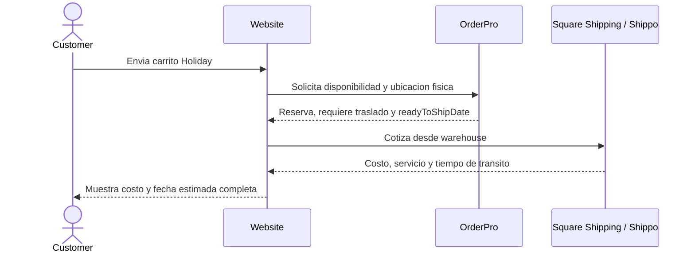
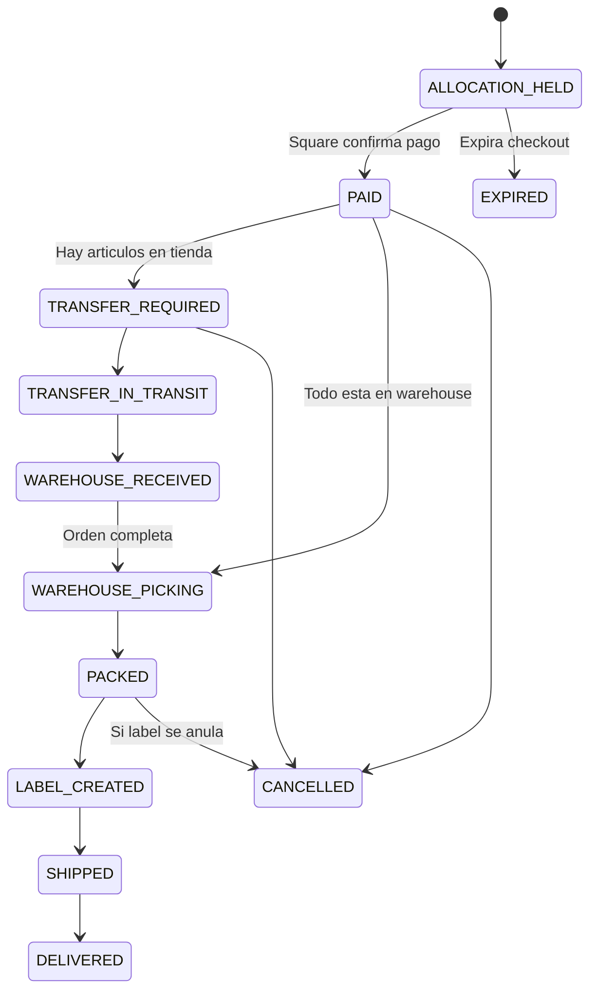

# Especificacion operativa de Shipping para OrderPro

Estado: borrador operativo para revision con OrderPro.

## 1. Objetivo

Definir como OrderPro debe localizar, reservar, trasladar y preparar los
productos de una orden con `shipping` antes de que el warehouse entregue el
paquete al transportista.

La regla principal es:

> Todos los pedidos de shipping salen fisicamente del warehouse, aunque el
> producto pertenezca comercialmente a una tienda Square o se encuentre
> fisicamente en una tienda al momento de la compra.

## 2. Responsabilidad de cada sistema

| Sistema | Responsabilidad |
| --- | --- |
| Website | Orquestar checkout, mostrar costo y fecha estimada, y nunca confiar en valores calculados por el navegador. |
| Square | Orden comercial, tienda propietaria de la venta, pago, impuestos y registro del shipment. |
| OrderPro | Ubicacion fisica real, disponibilidad, reserva, traslados tienda-warehouse, picking, consolidacion y estado operativo. |
| Square Shipping / Shippo | Tarifa del carrier, servicio seleccionado, etiqueta, tracking y eventos del transportista. |
| Warehouse | Recibir traslados, hacer pick/pack, pesar/verificar el paquete y entregarlo al carrier. |

Square y OrderPro manejan dos conceptos diferentes que nunca se deben mezclar:

```text
sellingLocationId          = tienda Square propietaria de la venta
physicalFulfillmentNodeId  = lugar fisico donde esta o se prepara el producto
```

Ejemplo:

```text
sellingLocationId          = store-3rd-avenue
physicalFulfillmentNodeId  = warehouse
pickLocation               = Aisle B / Shelf 3 / Bin 12
```

## 3. Reglas de negocio obligatorias

1. El origen de todos los shipments y etiquetas es siempre el warehouse.
2. OrderPro es la fuente de verdad de la ubicacion fisica y del bin de cada
   producto.
3. Square conserva la tienda propietaria para ventas, pagos, reportes e
   inventario comercial.
4. Si todos los articulos ya estan en el warehouse, no se agrega tiempo de
   traslado interno.
5. Si uno o mas articulos estan fisicamente en una tienda, OrderPro agrega una
   sola vez `2` dias de traslado a la promesa de esa orden.
6. Los dos dias no se suman por articulo ni por tienda. Una orden con tres
   articulos en tienda sigue recibiendo un solo ajuste de dos dias.
7. El tiempo del carrier comienza despues de que OrderPro determine que la
   orden estara completa y lista en el warehouse.
8. No se puede marcar una orden como `READY_TO_SHIP` hasta que todos sus
   articulos esten recibidos en el warehouse.
9. No se debe comprar o imprimir la etiqueta final antes de consolidar y
   verificar la orden, salvo que exista un proceso explicito para anular y
   regenerar etiquetas.
10. No se permiten sustituciones, partial shipments o backorders silenciosos.

### Regla temporal

Esta version usa **dos dias laborables** para un traslado tienda-warehouse. El
calendario, feriados y hora de corte deben ser configurables en OrderPro.

```text
readyToShipDate = fecha base de preparacion + transferLeadTime

transferLeadTime = 0 dias, si todo esta en warehouse
transferLeadTime = 2 dias laborables, si algun articulo esta en una tienda

estimatedDeliveryDate = readyToShipDate + carrierTransitTime
```

## 4. Flujo previo al pago

Antes de mostrar opciones de shipping, el website envia el carrito a OrderPro.
OrderPro debe:

1. Localizar cada variacion usando `squareVariationId`, SKU o GTIN.
2. Identificar la tienda propietaria del producto.
3. Identificar su ubicacion fisica actual y su bin.
4. Confirmar la cantidad disponible.
5. Determinar si necesita traslado al warehouse.
6. Calcular `readyToShipDate`.
7. Crear una reserva temporal con expiracion.
8. Devolver un `allocationToken` idempotente al website.

El website usa siempre la direccion del warehouse para solicitar la tarifa del
carrier. La fecha de salida usada para la promesa al cliente es la
`readyToShipDate` calculada por OrderPro.



## 5. Contrato de disponibilidad propuesto

### Solicitud del website a OrderPro

```json
{
  "requestId": "shipping-checkout-01J...",
  "cartId": "cart_123",
  "channel": "MODERN_STATE_WEBSITE",
  "fulfillmentMode": "SHIPPING",
  "holiday": {
    "id": "back-to-school-2026",
    "name": "Back to School"
  },
  "items": [
    {
      "squareVariationId": "SQ-VAR-NOTEBOOK",
      "sku": "NOTEBOOK-01",
      "quantity": 1
    },
    {
      "squareVariationId": "SQ-VAR-TOY",
      "sku": "TOY-04",
      "quantity": 1
    }
  ]
}
```

### Respuesta de OrderPro

```json
{
  "available": true,
  "allocationToken": "alloc_01J...",
  "expiresAt": "2026-07-20T15:15:00-04:00",
  "sellingLocationId": "store-3rd-avenue",
  "fulfillmentNodeId": "warehouse",
  "requiresStoreTransfer": true,
  "transferLeadTimeDays": 2,
  "readyToShipDate": "2026-07-22",
  "items": [
    {
      "squareVariationId": "SQ-VAR-NOTEBOOK",
      "quantity": 1,
      "ownerLocationId": "store-3rd-avenue",
      "physicalLocationId": "warehouse",
      "pickLocation": "A-12",
      "requiresTransfer": false
    },
    {
      "squareVariationId": "SQ-VAR-TOY",
      "quantity": 1,
      "ownerLocationId": "store-3rd-avenue",
      "physicalLocationId": "store-3rd-avenue",
      "pickLocation": "T-04",
      "requiresTransfer": true
    }
  ]
}
```

Si OrderPro no puede localizar o reservar todos los articulos, debe responder
`available: false` con un `reasonCode` estable. El website no debe ofrecer
shipping para esa seleccion.

Reason codes minimos:

- `ITEM_NOT_FOUND`
- `INSUFFICIENT_PHYSICAL_STOCK`
- `PHYSICAL_LOCATION_UNKNOWN`
- `PICK_LOCATION_UNKNOWN`
- `MULTIPLE_SELLING_LOCATIONS`
- `TRANSFER_UNAVAILABLE`
- `ORDERPRO_UNAVAILABLE`

## 6. Confirmacion posterior al pago

La reserva temporal no se convierte en trabajo operativo hasta que Square
confirme el pago. Despues del pago, el website envia a OrderPro una confirmacion
idempotente que incluye:

- `squareOrderId`
- `squarePaymentId`
- `allocationToken`
- tienda propietaria de la venta
- lineas, cantidades y precios finales
- datos de contacto necesarios
- direccion de destino
- shipping rate y service level seleccionado
- costo cobrado al cliente
- fecha prometida
- datos Holiday

OrderPro debe responder siempre con el mismo `orderProOrderId` cuando recibe la
misma clave de idempotencia.

## 7. Operacion de OrderPro despues del pago

### Cuando todo esta en el warehouse

1. Confirmar la reserva.
2. Crear el pick list por bin.
3. Cambiar a `WAREHOUSE_PICKING`.
4. Hacer pick, pack, peso y verificacion.
5. Comprar/imprimir etiqueta.
6. Guardar tracking.
7. Cambiar a `SHIPPED` cuando el paquete sea entregado al carrier.

### Cuando algun articulo esta en una tienda

1. Confirmar la reserva en la ubicacion fisica actual.
2. Crear una tarea de traslado por tienda de origen.
3. Mostrar tienda, SKU, cantidad, bin y fecha limite de salida.
4. Marcar el articulo `TRANSFER_IN_TRANSIT` cuando salga de la tienda.
5. Escanear y recibir el articulo en el warehouse.
6. Mover su ubicacion fisica al bin de recepcion o staging del warehouse.
7. Esperar todos los articulos antes de iniciar consolidacion final.
8. Continuar con pick/pack, etiqueta y tracking.

## 8. Estados operativos propuestos



OrderPro puede conservar nombres internos distintos, pero debe exponer una
traduccion estable hacia estos estados compartidos.

## 9. Ejemplo Holiday completo

Orden `Back to School` pagada en el Dia 0:

| Producto | Propietario Square | Ubicacion fisica | Accion |
| --- | --- | --- | --- |
| Cuaderno | 3rd Avenue | Warehouse, bin A-12 | Pick directo |
| Juego educativo | 3rd Avenue | 3rd Avenue, bin T-04 | Trasladar al warehouse |

Resultado:

```text
Dia 0: OrderPro reserva ambos articulos y confirma que requiere traslado.
Dias 1-2: la tienda envia el juego al warehouse.
Dia 2: warehouse recibe, consolida y prepara la orden.
Carrier: ejemplo de 2 dias de transito.
Entrega estimada: Dia 4.
```

Square registra la venta bajo 3rd Avenue. OrderPro registra que el shipment fue
preparado fisicamente en el warehouse.

## 10. Carritos con productos de distintas tiendas propietarias

Una orden Square creada por API solo puede estar asociada a una ubicacion
vendedora. Hasta aprobar una politica contable para carritos con propietarios
distintos, OrderPro debe responder `MULTIPLE_SELLING_LOCATIONS` y el checkout
debe bloquear o separar el carrito de forma explicita.

No se puede escoger una tienda propietaria silenciosamente.

## 11. Cancelaciones y excepciones

- Antes del pago: expirar la reserva sin crear tareas.
- Pagada, antes del traslado: cancelar tareas y liberar inventario.
- Durante el traslado: detener la orden y enviar el articulo a una cola de
  excepcion; no devolverlo automaticamente sin confirmacion fisica.
- Etiqueta creada: anular la etiqueta antes de cancelar el shipment.
- Articulo perdido o danado: cambiar a excepcion y notificar al website; no
  sustituir automaticamente.
- OrderPro caido o respuesta vencida: shipping se deshabilita temporalmente.
- Direccion o rate vencido: volver a cotizar antes de cobrar.

## 12. Seguridad e idempotencia

1. Toda comunicacion website-OrderPro debe usar autenticacion server-to-server.
2. Nunca enviar secretos de Square, Shippo o OrderPro al navegador.
3. Cada disponibilidad, confirmacion, cancelacion y cambio de estado debe incluir
   `requestId` o `idempotencyKey`.
4. Reintentar una solicitud no puede duplicar reservas, traslados u ordenes.
5. Registrar audit log con actor, timestamp, estado anterior, estado nuevo y
   correlation ID.
6. Minimizar y redactar datos personales en logs.

## 13. Datos que debe mostrar la pantalla del warehouse

- Numero de orden Square y OrderPro.
- Holiday/campana, cuando aplique.
- Tienda propietaria de la venta.
- Estado de pago de solo lectura.
- Fecha prometida y `readyToShipDate`.
- Articulos pendientes de traslado y tienda de origen.
- SKU, nombre, cantidad y bin de cada articulo.
- Estado de recepcion y consolidacion.
- Carrier, servicio, etiqueta y tracking.
- Excepciones y acciones auditadas.

## 14. Criterios de aceptacion

La integracion se considera lista cuando:

1. Un carrito con todo en warehouse no recibe los dos dias adicionales.
2. Un carrito con al menos un articulo en tienda recibe exactamente dos dias
   adicionales.
3. Dos o mas articulos en tienda no acumulan cuatro o mas dias.
4. La tarifa siempre usa la direccion del warehouse.
5. El pago y la venta quedan asociados a la tienda Square propietaria.
6. OrderPro genera y completa el traslado tienda-warehouse.
7. Warehouse no puede despachar una orden incompleta.
8. Reintentos no duplican reserva, orden o traslado.
9. Cancelaciones liberan o ponen en excepcion el inventario correcto.
10. Tracking y estados se reconcilian entre OrderPro, Square y el website.

## 15. Decisiones pendientes de confirmacion

- Calendario exacto de dias laborables y feriados.
- Hora de corte diaria para comenzar a contar los dos dias.
- Tiempo base de preparacion cuando todo esta en warehouse.
- Politica para productos de distintas tiendas propietarias en un mismo carrito.
- Politica de partial shipment, actualmente deshabilitado.
- Que sistema compra la etiqueta: Square Dashboard o automatizacion Shippo.
- Autenticacion, endpoints y formato final de webhooks de OrderPro.
